# jqp-admin-v2 低代码系统

## 简介

全部界面完全用amis编辑器设计,支持移动端,工作流,代码完全开源

## 技术栈

1. spring boot2.6.2
2. [magic-api2.0.2](https://www.ssssssss.org/magic-api/)
3. [amis 6.6.0](https://aisuda.bce.baidu.com/amis/zh-CN/docs/index)
4. [logic-flow](https://docs.logic-flow.cn/docs/#/)
5. mysql5.7.35-log

## 功能列表

| 功能      | 说明                                                                 |
| ----------- | ---------------------------------------------------------------------- |
| magic-api | 所有后台逻辑代码编写,支持定时任务                                    |
| 页面配置  | 所有界面设计,包括导航页面,登录页面                                   |
| 菜单配置  | 通过菜单类型来区分pc端还是移动端                                     |
| 数据字典  | 下拉框选项                                                           |
| 文件管理  | 可以管理上传的文件,或者通过此功能使用静态资源服务,避免整体项目包过大 |
| 流程管理  | 设计流程的地方                                                       |
| 测试订单  | 测试工作流                                                           |
| 流程任务  | 登录人能看到的任务                                                   |
| 用户管理  | 配置用户,设置用户角色                                                |
| 角色管理  | 管理角色,配置角色菜单                                                |

## 搭建开发环境

1. 开发工具 idea,配置maven,idea导入项目
2. 克隆代码  git clone git@gitee.com:hyz79/jqp-admin-v2.git
3. 新建数据库,注意数据库版本 jqp-admin-v2 并导入 src/main/resource/db/jqp-admin-v2.sql
4. 修改配置文件 application-dev.properties 设置数据库连接
5. 启动项目 JqpAdminV2Application
6. 访问 http://localhost:8080/   用户名/密码:admin/1

## 系统截图

### magic-api

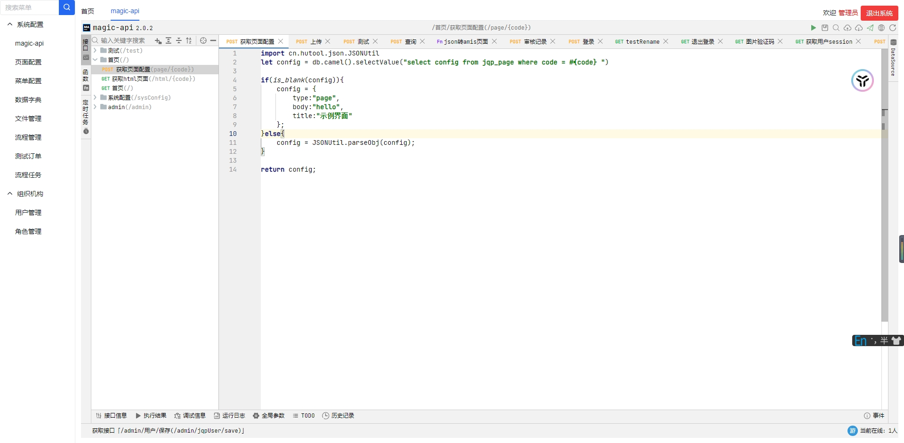

### 页面配置

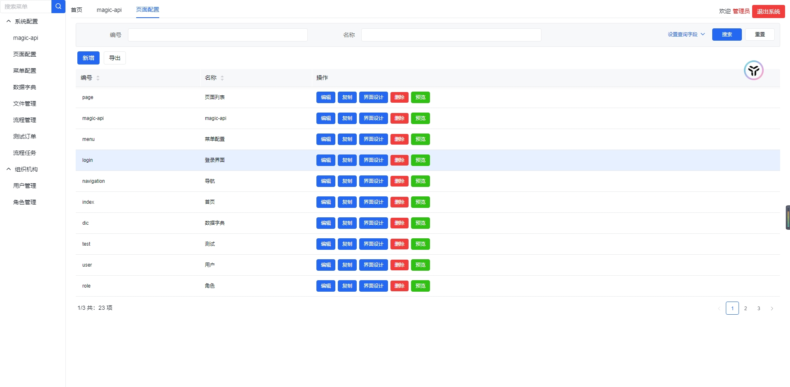
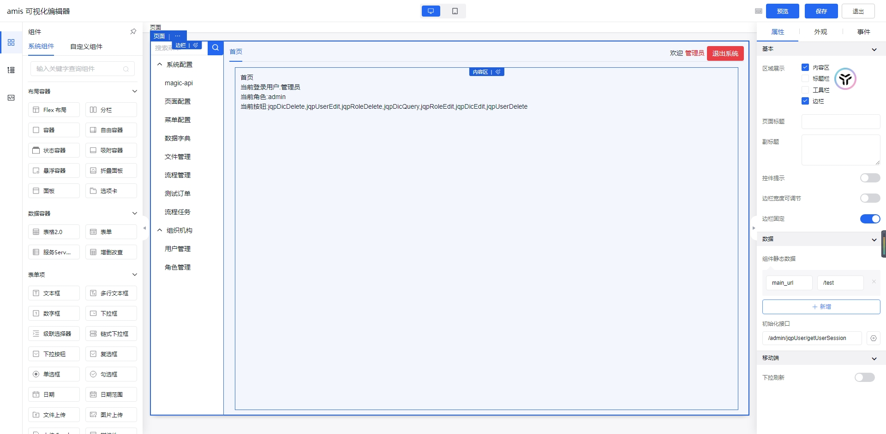

### 菜单管理

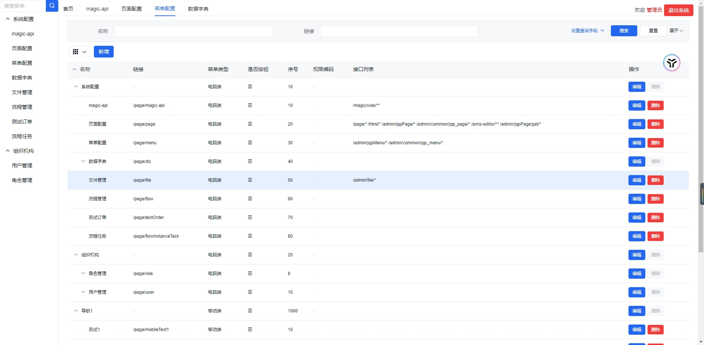

### 文件管理

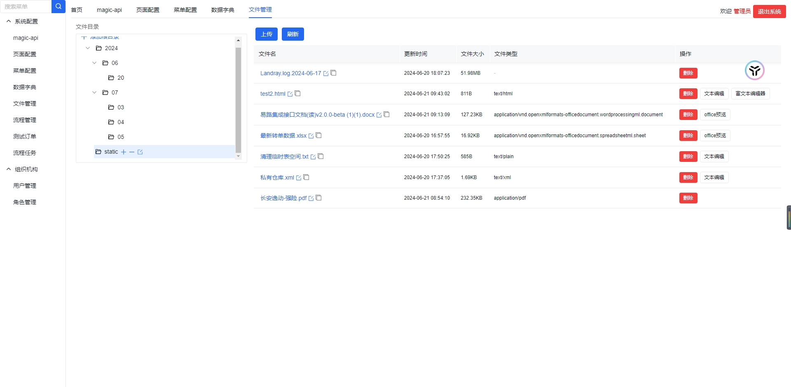

### 流程管理

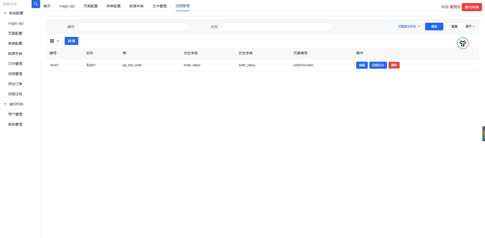
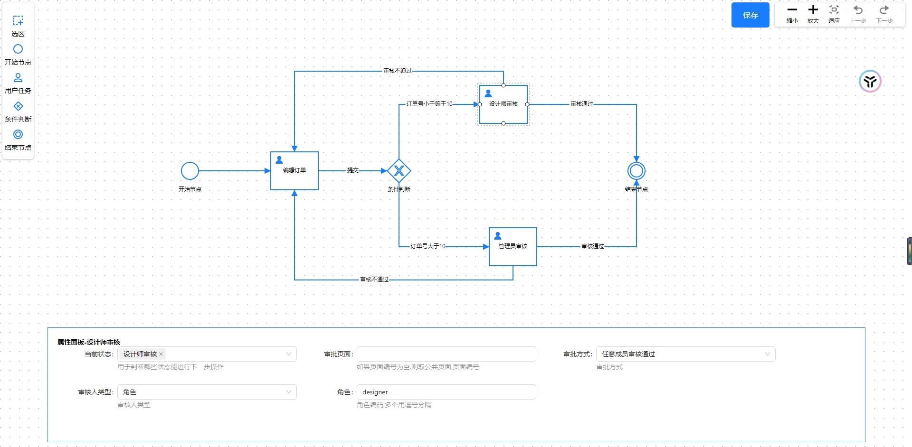

### 流程测试

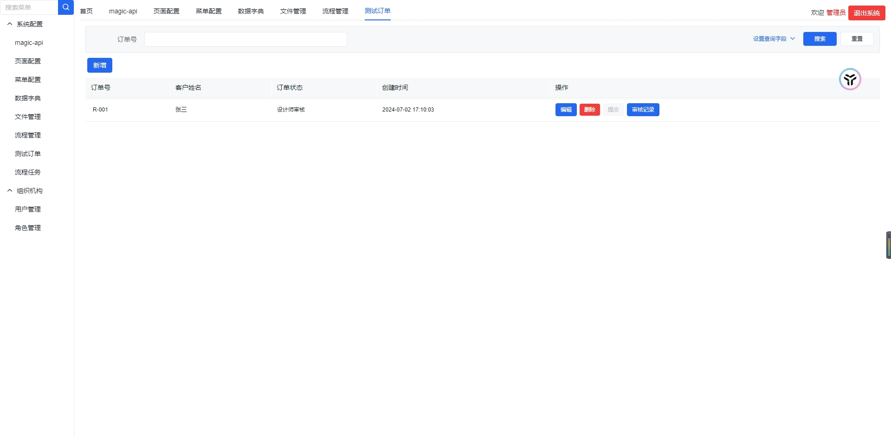
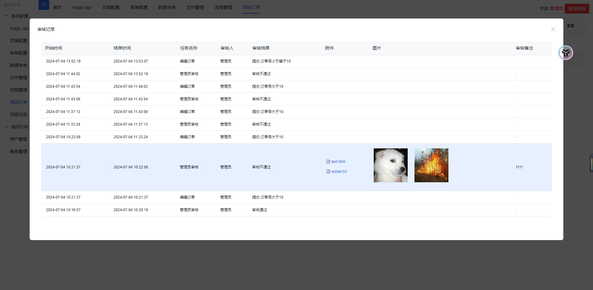

### 流程任务

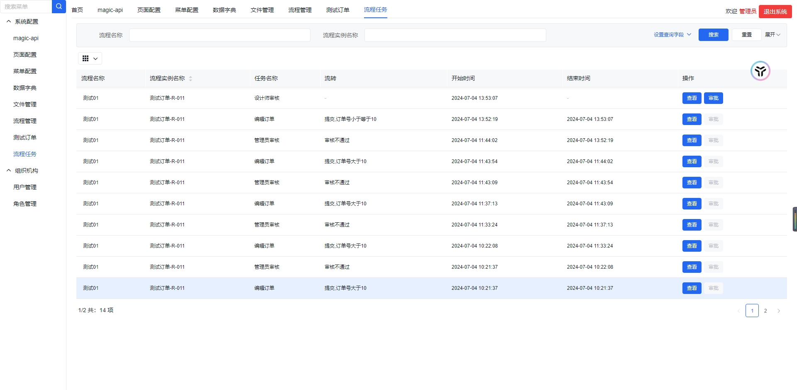
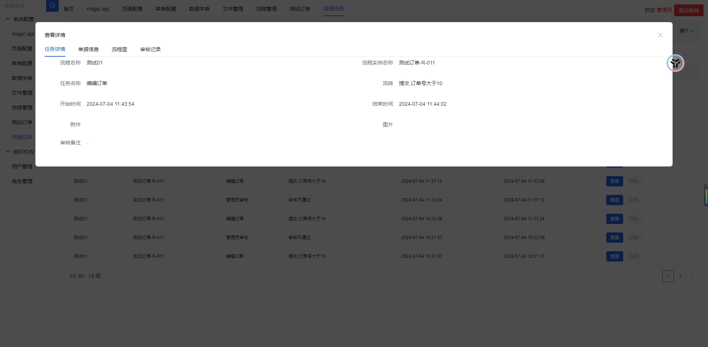
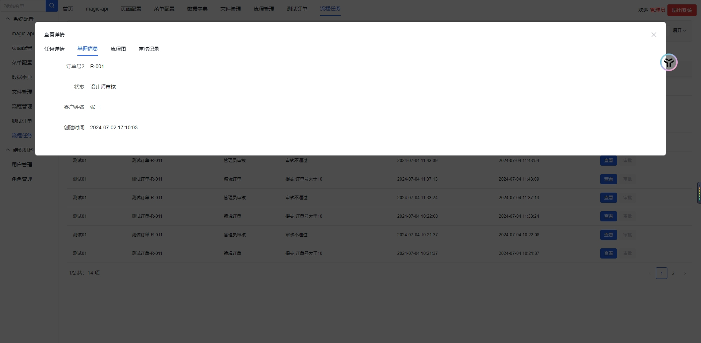
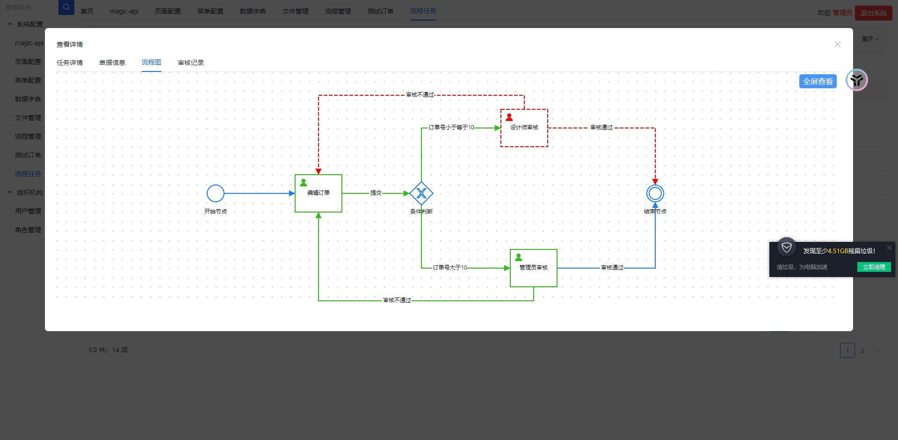
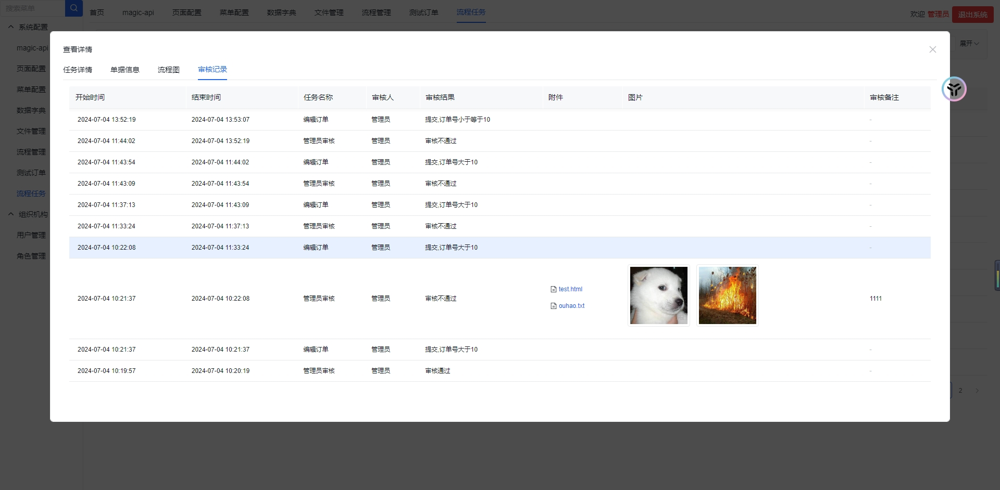
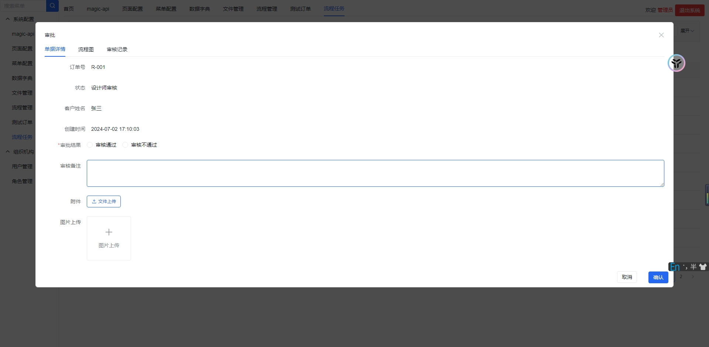

### 用户管理

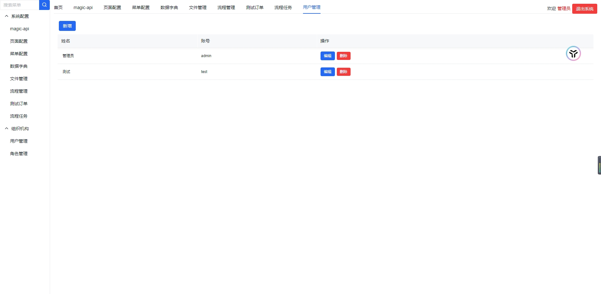

### 角色管理

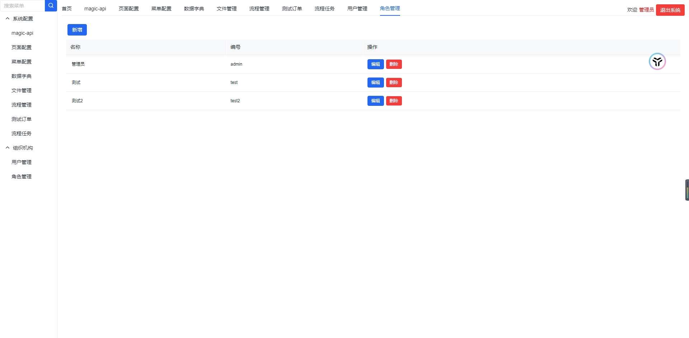
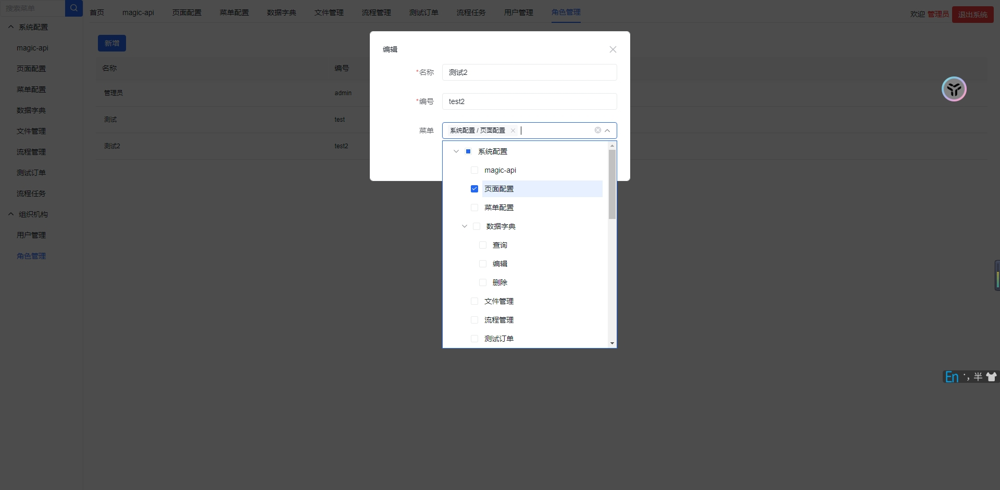

### 移动端

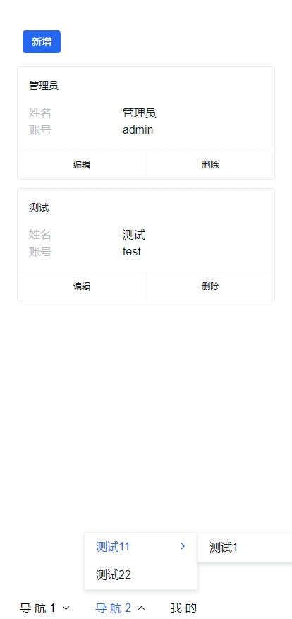
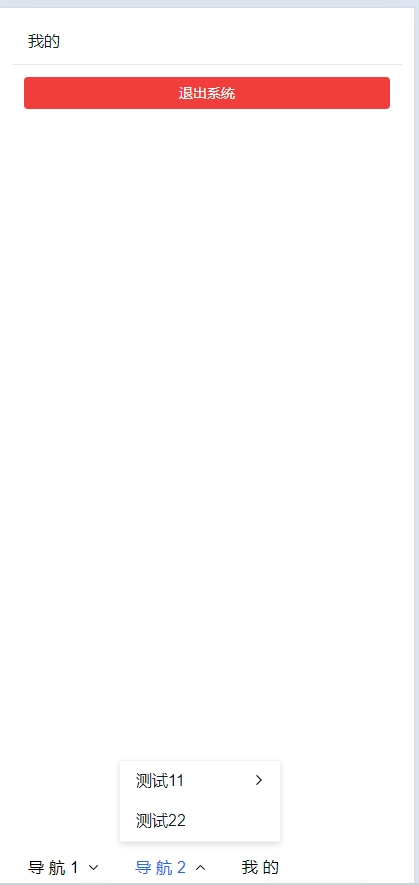
